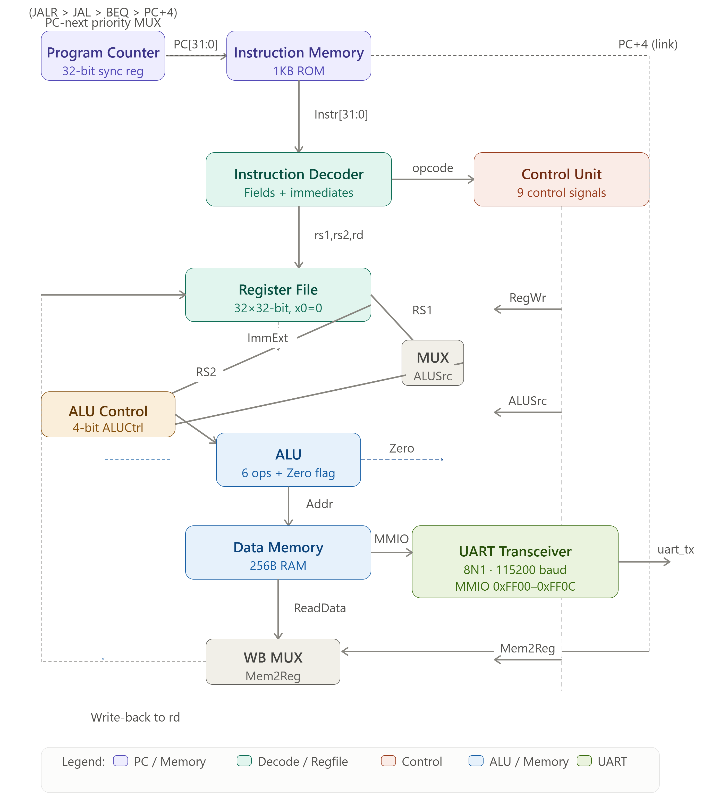
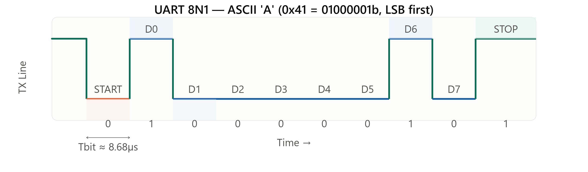
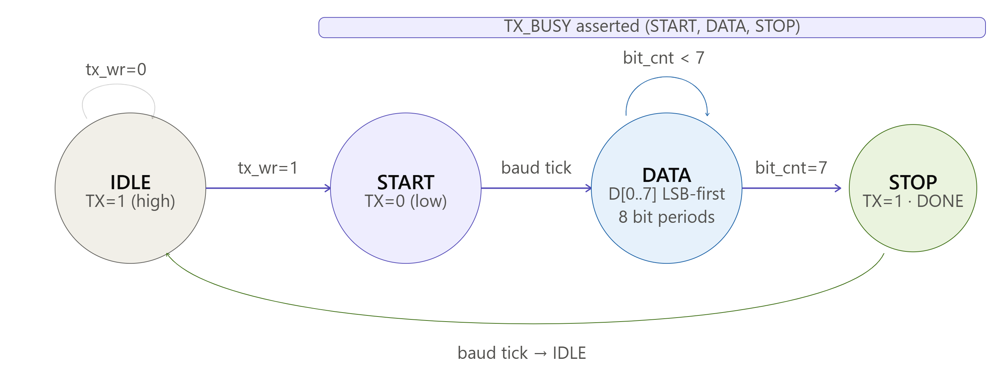

# Design and Implementation of a 32-bit Single-Cycle RISC-V Processor with Integrated UART Interface

> A fully verified RV32I single-cycle processor with a memory-mapped UART interface — designed in Verilog HDL and synthesized on Xilinx Artix-7 FPGA.


---

## Table of Contents

- [Overview](#overview)
- [Architecture](#architecture)
- [Supported Instructions](#supported-instructions)
- [Module Hierarchy](#module-hierarchy)
- [UART Subsystem](#uart-subsystem)
- [Memory Map](#memory-map)
- [Datapath Block Diagram](#datapath-block-diagram)
- [UART Timing Diagram](#uart-timing-diagram)
- [UART TX FSM](#uart-tx-fsm)
- [Test Program](#test-program)
- [Simulation & Verification](#simulation--verification)
- [Synthesis Results](#synthesis-results)
- [Getting Started](#getting-started)
- [File Structure](#file-structure)
- [Authors](#authors)

---

## Overview

This project implements a **32-bit single-cycle processor** based on the **RISC-V RV32I base integer ISA**, augmented with a fully programmable **UART serial communication interface** accessible through memory-mapped I/O (MMIO). The design targets Xilinx FPGA platforms and is verified using a self-checking Verilog testbench in Xilinx Vivado 2022.1.

**Key highlights:**

- Complete RV32I datapath — fetch, decode, execute, memory, write-back all in one clock cycle
- 10 modular sub-components with clean wire-level interconnections
- UART transceiver with 8N1 framing and 16× oversampling receiver
- Software-configurable baud rate via MMIO register
- Synthesized on Artix-7 at **116.5 MHz** — exceeding the 100 MHz target
- Modest footprint: 312 LUTs, 128 FFs, 2 BRAMs

---

## Architecture

The processor implements a **Harvard-inspired single-cycle datapath** with logically separated instruction and data memories sharing a unified 32-bit address space.

On every rising clock edge, the Program Counter (PC) advances and all combinational stages — decode, execute, memory access, and write-back — complete within the same clock period.

### PC Next Priority Logic

The next PC value is selected using a four-way priority multiplexer:

| Priority | Condition         | PC Target              |
|----------|-------------------|------------------------|
| 1 (highest) | JALR           | `(RS1 + ImmExt) & ~1` |
| 2        | JAL               | `PC + ImmExt`          |
| 3        | BEQ (taken)       | `PC + ImmExt`          |
| 4 (lowest) | Sequential      | `PC + 4`               |

> The LSB of JALR targets is cleared to enforce 4-byte instruction alignment per the RISC-V specification.

---

## Supported Instructions

| Type   | Instructions                              |
|--------|-------------------------------------------|
| R-Type | `ADD`, `SUB`, `AND`, `OR`, `XOR`, `SLT`  |
| I-Arith | `ADDI`, `ANDI`, `ORI`, `XORI`           |
| I-Mem  | `LW`                                      |
| I-Jump | `JALR`                                    |
| S-Type | `SW`                                      |
| B-Type | `BEQ`                                     |
| J-Type | `JAL`                                     |
| U-Type | `LUI`                                     |

---

## Module Hierarchy

<h2>Module Overview</h2>

<table>
  <thead>
    <tr>
      <th>Module</th>
      <th>Functionality</th>
    </tr>
  </thead>
  <tbody>
    <tr>
      <td><b>Single_Cycle_Processor (Top)</b></td>
      <td>Top-level module that integrates all processor components.</td>
    </tr>
    <tr>
      <td><b>Program_Counter</b></td>
      <td>32-bit synchronous program counter that resets to <code>0x00000000</code>.</td>
    </tr>
    <tr>
      <td><b>Instruction_Memory</b></td>
      <td>1 KB ROM with little-endian organization, initialized from a hexadecimal file.</td>
    </tr>
    <tr>
      <td><b>Instruction_Decoder</b></td>
      <td>Decodes instruction fields and sign-extends immediate values.</td>
    </tr>
    <tr>
      <td><b>Control_Unit</b></td>
      <td>Generates 9 control signals and a 2-bit <code>ALUOp</code> based on the instruction opcode.</td>
    </tr>
    <tr>
      <td><b>Register_File</b></td>
      <td>32 × 32-bit register file with synchronous write, asynchronous read, and <code>x0</code> permanently tied to zero.</td>
    </tr>
    <tr>
      <td><b>ALU_Control</b></td>
      <td>Produces a 4-bit ALU control signal from <code>{ALUOp, funct3, funct7[5]}</code>.</td>
    </tr>
    <tr>
      <td><b>ALU</b></td>
      <td>Executes six arithmetic and logic operations and generates the <code>Zero</code> flag for <code>BEQ</code> instructions.</td>
    </tr>
    <tr>
      <td><b>Data_Memory</b></td>
      <td>256-byte data memory with synchronous write and asynchronous read.</td>
    </tr>
    <tr>
      <td><b>UART_Transceiver</b></td>
      <td>UART transmitter/receiver featuring TX/RX state machines, baud-rate generator, and memory-mapped I/O registers.</td>
    </tr>
  </tbody>
</table>
 

### Control Unit Truth Table

| Instruction | RegWr | ALUSrc | MemWr | Mem2Reg | Branch | Jump | ALUOp |
|-------------|:-----:|:------:|:-----:|:-------:|:------:|:----:|:-----:|
| R-Type      | 1     | 0      | 0     | 0       | 0      | 0    | 10    |
| I-Arith     | 1     | 1      | 0     | 0       | 0      | 0    | 10    |
| LW          | 1     | 1      | 0     | 1       | 0      | 0    | 00    |
| SW          | 0     | 1      | 1     | 0       | 0      | 0    | 00    |
| BEQ         | 0     | 0      | 0     | 0       | 1      | 0    | 01    |
| JAL         | 1     | —      | 0     | 0       | 0      | 1    | —     |
| JALR        | 1     | 1      | 0     | 0       | 0      | 1    | 00    |
| LUI         | 1     | 1      | 0     | 0       | 0      | 0    | 11    |

### ALU Control Encoding

| ALUCtrl | Operation      | funct3 | funct7[5] |
|---------|---------------|--------|-----------|
| 0000    | ADD           | 000    | 0         |
| 0001    | SUB           | 000    | 1         |
| 0010    | AND           | 111    | X         |
| 0011    | OR            | 110    | X         |
| 0100    | XOR           | 100    | X         |
| 0101    | SLT (signed)  | 010    | X         |
| 0110    | LUI pass-thru | —      | —         |

---

## UART Subsystem

### Protocol

The UART implements **8N1 framing**: 1 start bit (logic 0), 8 data bits (LSB first), 1 stop bit (logic 1) — 10 bits per character. No parity bit in the baseline configuration.

### Baud Rate Generator

The bit-clock is derived from the system clock using an integer divider:

```
DIV = fclk / B − 1
    = 100,000,000 / 115,200 − 1
    = 866
```

The divider is stored in the `UART_BAUD` MMIO register, making the baud rate **software-configurable at runtime**.

A **16× oversampling** scheme is used in the receiver to locate the centre of each received bit, improving noise immunity.

### TX FSM States

| State | TX Line | Condition   | Next State |
|-------|---------|-------------|------------|
| IDLE  | 1 (high)| tx_wr = 0   | IDLE       |
| IDLE  | 1 (high)| tx_wr = 1   | START      |
| START | 0 (low) | baud tick   | DATA       |
| DATA  | D[n]    | bit_cnt < 7 | DATA       |
| DATA  | D[7]    | bit_cnt = 7 | STOP       |
| STOP  | 1 (high)| baud tick   | IDLE       |

`TX_BUSY` is asserted throughout START, DATA, and STOP states.

### RX FSM

The receiver uses 16× oversampling for start-bit detection (waits 8 ticks to verify line is low) and samples each bit at the centre (every 16 ticks). A **Framing Error (FE)** flag is set if the stop bit is sampled as 0.

---

## Memory Map

| Address Range     | Region            | Description                     |
|-------------------|-------------------|---------------------------------|
| `0x0000–0x03FF`   | Instruction Memory| 1KB ROM (program)               |
| `0x0000–0x00FF`   | Data Memory       | 256B RAM                        |
| `0xFF00`          | UART_TX_DATA      | TX data register (write only)   |
| `0xFF04`          | UART_STATUS       | Status flags (read only)        |
| `0xFF08`          | UART_RX_DATA      | RX data register (read only)    |
| `0xFF0C`          | UART_BAUD         | Baud rate divisor (read/write)  |

### UART_STATUS Register (0xFF04)

```
 Bit 31–3   Bit 2    Bit 1      Bit 0
 Reserved    FE     TX_BUSY   RX_READY
```

- **RX_READY** — Set when a complete byte is received; cleared on read of `UART_RX_DATA`
- **TX_BUSY** — Set while transmission is in progress
- **FE** — Framing error; set if stop bit is invalid

---

## Datapath Block Diagram

<p align="center">
  
</p>

Signal flow runs top-to-bottom: PC → Instruction Memory → Decoder → Register File / ALU → Data Memory / UART → Write-Back MUX → Register File. Control signals from the Control Unit fan out horizontally to coordinate all datapath stages.

---

## UART Timing Diagram

<p align="center">
  
</p>

Transmission of ASCII `'A'` (`0x41 = 01000001b`). Start bit drives TX low for one bit period (Tbit ≈ 8.68 µs at 115200 baud); data bits D[0]–D[7] follow LSB-first; stop bit returns TX high.

---

## UART TX FSM

<p align="center">
  
</p>

Four-state FSM: IDLE → START → DATA (self-loop on bit_cnt < 7) → STOP → IDLE. TX_BUSY is asserted across START, DATA, and STOP.

---

## Test Program

The instruction memory is pre-loaded with a 13-instruction test sequence:

| Address | Instruction          | Operation        | Expected Result    |
|---------|----------------------|------------------|--------------------|
| 0x00    | `ADDI x1, x0, 10`   | x1 = 10          | x1 = 0x0A          |
| 0x04    | `ADDI x2, x0, 5`    | x2 = 5           | x2 = 0x05          |
| 0x08    | `ADD  x3, x1, x2`   | x3 = x1 + x2     | x3 = 0x0F          |
| 0x0C    | `SUB  x3, x1, x2`   | x3 = x1 − x2     | x3 = 0x05          |
| 0x10    | `SW   x3, 0(x0)`    | Mem[0] = x3      | Mem[0] = 5         |
| 0x14    | `LW   x4, 0(x0)`    | x4 = Mem[0]      | x4 = 0x05          |
| 0x18    | `LUI  x5, 0xFF`     | x5 = 0xFF000     | UART base address  |
| 0x1C    | `ADDI x6, x0, 0x48` | x6 = 'H'         | x6 = 0x48          |
| 0x20    | `LW   x7, 4(x5)`    | x7 = UART_STATUS | x7[1] = TX_BUSY    |
| 0x24    | `ANDI x7, x7, 2`    | isolate TX_BUSY  | 0 if ready         |
| 0x28    | `BEQ  x7, x0, 4`    | branch if ready  | PC = 0x30          |
| 0x2C    | `JAL  x0, -12`      | poll loop        | re-check status    |
| 0x30    | `SW   x6, 0(x5)`    | TX 'H' via UART  | serial TX          |

### UART TX Polling Sequence (Assembly)

```asm
poll:
    LUI   x10, 0xFF       # Load UART base address (0xFF000) into x10
    LW    x11, 4(x10)     # Read UART_STATUS into x11
    ANDI  x11, x11, 2     # Isolate TX_BUSY bit (bit 1)
    BNE   x11, x0, poll   # Loop back if TX busy
    ADDI  x12, x0, 0x48   # Load ASCII 'H' (0x48) into x12
    SW    x12, 0(x10)     # Write to UART_TX_DATA; trigger TX
```

---

## Simulation & Verification

### Testbench Architecture

- Clock: 100 MHz (10 ns period, 50% duty cycle)
- Synchronous reset held for 1 full clock cycle
- `$monitor` task logs: PC, Instr, ALU_Result, Zero, RegWrite, MemWrite, MemRead, Branch, uart_tx

### Expected Results (Cycles 1–8)

| Cycle | PC   | Instruction      | Result/Effect    |
|-------|------|------------------|------------------|
| 1     | 0x00 | ADDI x1, x0, 10  | x1 = 10          |
| 2     | 0x04 | ADDI x2, x0, 5   | x2 = 5           |
| 3     | 0x08 | ADD x3, x1, x2   | x3 = 15          |
| 4     | 0x0C | SUB x3, x1, x2   | x3 = 5           |
| 5     | 0x10 | SW x3, 0(x0)     | Mem[0] = 5       |
| 6     | 0x14 | LW x4, 0(x0)     | x4 = 5           |
| 7     | 0x18 | LUI x5, 0xFF     | x5 = 0xFF000     |
| 8     | 0x1C | ADDI x6, x0, 72  | x6 = 0x48 ('H')  |

### UART TX Assertion Criteria

| Event               | Expected Behaviour          | Pass Condition              |
|---------------------|-----------------------------|-----------------------------|
| SW to 0xFF00        | TX_BUSY asserted            | Within 1 clock cycle        |
| TX falling edge     | Start bit detected          | uart_tx = 0                 |
| Data bits D[0]–D[7] | 1,0,0,0,0,0,1,0 (LSB first) | Bit sequence matches        |
| Stop bit            | TX line returns high        | uart_tx = 1                 |
| TX_DONE assertion   | Transmission complete       | Within 90 µs of start       |

---

## Synthesis Results

Target: **Xilinx Artix-7 (xc7a35tcpg236-1)** — Vivado 2022.1

| Resource         | Used  | Available |
|------------------|-------|-----------|
| LUT6 (logic)     | 312   | 20,800    |
| LUT6 (as memory) | 64    | 9,600     |
| Flip-Flops       | 128   | 41,600    |
| BRAM (18K)       | 2     | 50        |
| IOB              | 4     | 106       |

| Metric           | Value     | Constraint    |
|------------------|-----------|---------------|
| WNS (setup)      | +1.42 ns  | 10 ns period  |
| Critical path    | 8.58 ns   | PC→ALU→WB     |
| **fmax**         | **116.5 MHz** | 100 MHz target |
| Dynamic power    | 28 mW     | —             |

The critical path runs from PC output → instruction memory fetch → register file read → ALU execution → write-back, consistent with single-cycle behaviour. UART baud generation adds < 0.3 ns overhead.

---

## Getting Started

### Prerequisites

- [Xilinx Vivado 2022.1](https://www.xilinx.com/support/download.html) (or later)
- Xilinx Artix-7 FPGA board (xc7a35tcpg236-1 or compatible)
- Serial terminal (e.g. PuTTY, minicom) — 115200 8N1

### Clone the Repository

```bash
git clone https://github.com/<your-username>/riscv-single-cycle-uart.git
cd riscv-single-cycle-uart
```

### Simulation (Vivado)

1. Open Vivado and create a new project targeting your FPGA.
2. Add all `.v` files from `rtl/` as design sources.
3. Add `tb/tb_Single_Cycle_Processor.v` as a simulation source.
4. Load the test program hex file into `sim/program.hex`.
5. Run **Behavioral Simulation** — the self-checking testbench will log results to the console.

```tcl
# In Vivado Tcl console:
launch_simulation
run 10us
```

### Synthesis & Implementation

```tcl
launch_runs synth_1 -jobs 4
wait_on_run synth_1
launch_runs impl_1 -to_step write_bitstream -jobs 4
wait_on_run impl_1
```

### Program the FPGA

```tcl
open_hw_manager
connect_hw_server
open_hw_target
program_hw_devices [get_hw_devices xc7a35t_0]
```

### Verify UART Output

Connect your serial terminal at **115200 baud, 8N1**. On reset, the processor will execute the test program and transmit `'H'` over the TX pin.

---

## File Structure

<h2>📁 Project Structure</h2>

<ul>
  <li><strong>📦 riscv-single-cycle-uart/</strong>
    <ul>
      <li>📂 <strong>rtl/</strong>
        <ul>
          <li>📄 Single_Cycle_Processor.v <em>— Top-level integration</em></li>
          <li>📄 Program_Counter.v</li>
          <li>📄 Instruction_Memory.v</li>
          <li>📄 Instruction_Decoder.v</li>
          <li>📄 Control_Unit.v</li>
          <li>📄 Register_File.v</li>
          <li>📄 ALU_Control.v</li>
          <li>📄 ALU.v</li>
          <li>📄 Data_Memory.v</li>
          <li>📄 UART_Transceiver.v</li>
        </ul>
      </li>

      <li>📂 <strong>tb/</strong>
        <ul>
          <li>📄 tb_Single_Cycle_Processor.v <em>— Self-checking testbench</em></li>
        </ul>
      </li>

      <li>📂 <strong>sim/</strong>
        <ul>
          <li>📄 program.hex <em>— Test program (Hex format)</em></li>
        </ul>
      </li>

      <li>📂 <strong>constraints/</strong>
        <ul>
          <li>📄 artix7.xdc <em>— Pin &amp; timing constraints</em></li>
        </ul>
      </li>

      <li>📂 <strong>docs/</strong>
        <ul>
          <li>📂 <strong>images/</strong>
            <ul>
              <li>🖼️ riscv_processor_block_diagram.png</li>
              <li>🖼️ uart_8n1_timing_diagram.png</li>
              <li>🖼️ uart_tx_fsm_diagram.png</li>
            </ul>
          </li>
          <li>📄 report.pdf</li>
        </ul>
      </li>

      <li>📄 <strong>README.md</strong></li>
    </ul>
  </li>
</ul>

---

## Future Work

- **Pipelined execution** — 5-stage pipeline with hazard detection and forwarding
- **Cache memory** — Direct-mapped instruction and data caches
- **UART enhancements** — Hardware flow control (RTS/CTS), 16-byte FIFO buffers
- **RV32M extension** — Integer multiply and divide instructions
- **RV32C extension** — 16-bit compressed instructions
- **Interrupt controller** — Timer and UART RX interrupt support

---

## Authors

| Name | Reg. No. | Email |
|------|----------|-------|
| **Raham Dil** | 2024529 | u2024529@giki.edu.pk |
| **Abdur Rehman Muzaffar** | 2024722 | u2024722@giki.edu.pk |

Department of Computer Engineering — Ghulam Ishaq Khan Institute (GIKI)

---

## References

1. D. Patterson and J. Hennessy, *Computer Organization and Design RISC-V Edition*, 2nd ed. Morgan Kaufmann, 2020.
2. RISC-V International, *The RISC-V Instruction Set Manual, Volume I: Unprivileged ISA*, Version 20191213, Dec. 2019.
3. S. Harris and D. Harris, *Digital Design and Computer Architecture: RISC-V Edition*. Morgan Kaufmann, 2021.
4. Texas Instruments, *UART Serial Communication*, App Report SLAA074, Sep. 2002.
5. Xilinx Inc., *Vivado Design Suite User Guide: Simulation*, UG900, 2022.

---

## License

This project is released under the [MIT License](LICENSE). See `LICENSE` for details.

---

*Designed and verified using Xilinx Vivado 2022.1 — Computer Engineering Project, GIKI.*
